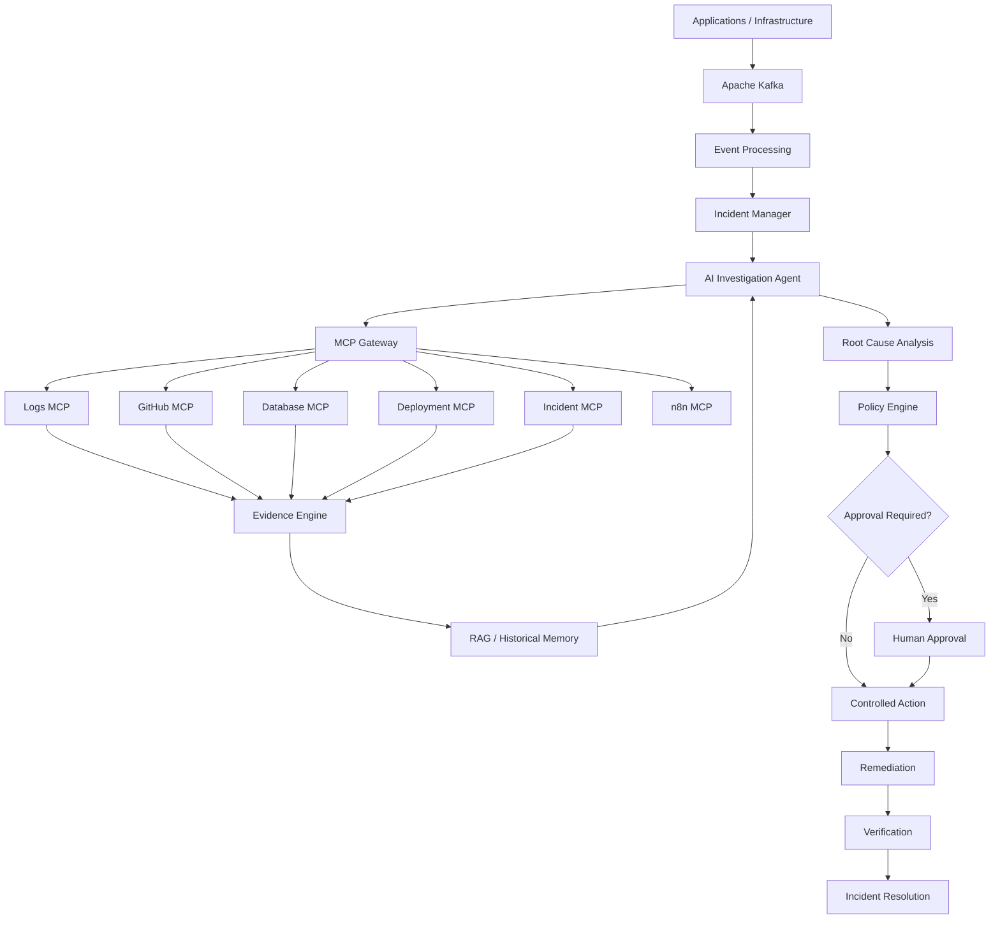

# 🛡️ AegisOps AI

### Evidence-Driven AI Incident Intelligence & Autonomous Operations

> **Detect → Investigate → Correlate → Explain → Approve → Remediate**

AegisOps AI is an **event-driven AI operations platform** that investigates production incidents using real-time events, LLM agents, MCP tools, historical incident memory, and controlled automation.

It combines **Apache Kafka, LangGraph, Model Context Protocol (MCP), RAG, PostgreSQL, Qdrant, n8n, and human-in-the-loop safety controls** into a single AI-native operations workflow.

Instead of simply telling engineers *"something is wrong"*, AegisOps AI attempts to answer:

> **What happened? Why did it happen? What evidence supports that conclusion? What should we do next? And is it safe to automate the fix?**

---

## ✨ Why AegisOps?

Modern production systems generate enormous amounts of:

- Logs
- Metrics
- Alerts
- Deployments
- Git commits
- Database events
- Traces
- Incident history

The problem isn't a lack of data.

**The problem is connecting the evidence quickly enough to make a reliable decision.**

AegisOps AI creates an evidence-bound investigation loop:

```text
Production Event
      ↓
     Kafka
      ↓
Incident Detection
      ↓
AI Investigation Agent
      ↓
 ┌────┴─────────────────────┐
 │                          │
 ▼                          ▼
MCP Tools              Historical Memory
 │                          │
 ├── Logs                   ├── Similar Incidents
 ├── GitHub                 ├── Runbooks
 ├── Database               └── Previous Resolutions
 └── Deployment
 │
 └──────────────┬────────────┘
                ↓
        Evidence Correlation
                ↓
        Root Cause Analysis
                ↓
       Confidence Assessment
                ↓
        Recommended Action
                ↓
         Policy Validation
                ↓
         Human Approval
                ↓
       Controlled Remediation
                ↓
          Verification
```

---

# 🚀 Core Capabilities

### 🔴 Real-Time Incident Detection

Consume operational events through **Apache Kafka** and identify abnormal conditions across services.

### 🧠 AI Incident Investigation

Use an LLM-powered LangGraph agent to investigate incidents through structured, multi-step reasoning.

### 🔌 MCP-Native Tooling

Expose operational capabilities through Model Context Protocol servers instead of giving the LLM unrestricted access to infrastructure.

Planned MCP servers include:

```text
Logs MCP
GitHub MCP
Database MCP
Deployment MCP
Incident MCP
n8n MCP
```

### 🔎 Evidence-Based Root Cause Analysis

The agent does not simply generate a guess.

It collects evidence from multiple sources and separates:

```text
FACTS
HYPOTHESES
UNKNOWN INFORMATION
RECOMMENDATIONS
```

### 🧬 Historical Incident Memory

Retrieve similar incidents, previous resolutions, runbooks, and operational knowledge using RAG.

### 🔐 Human-in-the-Loop Remediation

High-risk actions require explicit approval before execution.

```text
AI Recommendation
       ↓
Risk Assessment
       ↓
Policy Check
       ↓
Human Approval
       ↓
MCP Action
       ↓
Verification
```

### ⚙️ n8n Automation

Use n8n to orchestrate external workflows such as:

- Slack notifications
- Jira tickets
- Email
- Teams
- Incident escalation
- Approval workflows
- External APIs

### 📊 AI Operations Observability

Track:

- Kafka events
- Consumer lag
- Agent executions
- MCP calls
- Tool failures
- LLM latency
- Token usage
- Investigation duration
- Root-cause confidence
- Remediation success

### 🧪 AI Evaluation

AegisOps is designed to measure its own reliability.

Evaluation includes:

- Root-cause accuracy
- Tool-selection accuracy
- Hallucination rate
- Evidence grounding
- MCP failures
- Unsafe action attempts
- Investigation latency
- Number of unnecessary tool calls

---

# 🏗️ Architecture



---

# 🧩 Technology Stack

| Layer | Technology |
|---|---|
| Language | Python |
| API | FastAPI |
| Event Streaming | Apache Kafka |
| AI Orchestration | LangGraph |
| LLM | Provider-agnostic |
| Tool Protocol | MCP |
| Database | PostgreSQL |
| Vector Database | Qdrant |
| Workflow Automation | n8n |
| Cache | Redis |
| Frontend | React |
| Containers | Docker |
| Orchestration | Kubernetes |
| Observability | Prometheus + Grafana |
| Testing | Pytest |
| CI/CD | GitHub Actions |

---

# 🔌 MCP Architecture

AegisOps does not give the AI agent unrestricted infrastructure access.

Instead:

```text
                    AI Agent
                       │
                       ▼
                  MCP Protocol
                       │
          ┌────────────┼────────────┐
          ▼            ▼            ▼
       Logs MCP     GitHub MCP    DB MCP
          │            │            │
          ▼            ▼            ▼
        Logs         GitHub       Database
```

Each capability is exposed through a controlled interface.

Example:

```text
search_logs()
get_recent_commits()
get_database_health()
get_deployments()
create_incident()
```

This creates a clear boundary between:

**AI reasoning**

and

**system capabilities.**

---

# 📡 Kafka Event Architecture

Kafka acts as the event backbone.

Planned topics:

```text
logs.raw
metrics.raw
alerts.raw
deployments.events

incidents.created
incidents.updated

ai.analysis
ai.actions
```

Example event:

```json
{
  "event_id": "evt-1042",
  "timestamp": "2026-10-07T10:30:00Z",
  "service": "payment-service",
  "severity": "ERROR",
  "event_type": "database_timeout",
  "message": "Database connection timeout",
  "metadata": {
    "environment": "production",
    "region": "ap-south-1"
  }
}
```

---

# 🧠 AI Investigation Flow

Suppose the payment service suddenly starts failing.

AegisOps receives:

```text
payment-service
500 errors ↑
database timeout ↑
```

The agent begins an investigation.

### Step 1 — Logs

```text
search_logs(
    service="payment-service",
    severity="ERROR"
)
```

### Step 2 — Deployment History

```text
get_deployments(
    service="payment-service"
)
```

### Step 3 — GitHub

```text
get_recent_commits(
    service="payment-service"
)
```

### Step 4 — Database

```text
get_database_health()
get_connection_pool()
```

### Step 5 — Historical Memory

```text
search_similar_incidents(
    "database connection exhaustion"
)
```

The agent correlates the evidence.

---

# 🔬 Example AI Investigation

```text
INCIDENT #1042
────────────────────────────────────────

Service:
payment-service

Severity:
CRITICAL

Observed Symptoms:
• Database timeout rate increased
• Connection pool reached maximum capacity
• HTTP 500 errors increased

Evidence:

[Logs]
87% increase in database connection failures

[Deployment]
Version v2.8.1 deployed 11 minutes before incident

[GitHub]
v2.8.1 modified database connection handling

[Database]
Connection pool exhausted

[Historical Memory]
Similar incident #872 involved a connection leak

────────────────────────────────────────

Candidate Causes:

H1 — Database infrastructure failure
Confidence: 21%

H2 — Connection pool exhaustion
Confidence: 91%

H3 — Network instability
Confidence: 14%

────────────────────────────────────────

MOST LIKELY ROOT CAUSE

Connection pool exhaustion introduced by
the recent payment-service deployment.

Confidence: 91%

────────────────────────────────────────

RECOMMENDED ACTION

Rollback payment-service to v2.8.0

Risk:
HIGH

Approval:
REQUIRED
```

---

# 🛡️ Safety Model

AegisOps follows a strict principle:

> **The LLM proposes. The system validates. The human approves. The infrastructure executes.**

Actions are classified:

```text
READ
LOW_RISK
MEDIUM_RISK
HIGH_RISK
DESTRUCTIVE
```

Example:

| Action | Risk | Approval |
|---|---:|---|
| Search logs | READ | No |
| Check DB health | READ | No |
| Create incident | LOW | No |
| Create Jira ticket | LOW | Optional |
| Restart service | MEDIUM | Yes |
| Rollback deployment | HIGH | Yes |
| Delete infrastructure | DESTRUCTIVE | Blocked |

The LLM never receives unrestricted shell or infrastructure access.

---

# 🔄 n8n Integration

n8n is used as the external workflow automation layer.

Example:

```text
AI detects CRITICAL incident
              ↓
          n8n MCP
              ↓
      ┌───────┼────────┐
      ▼       ▼        ▼
    Slack    Jira     Email
      │       │        │
      └───────┼────────┘
              ▼
        Human Approval
```

This keeps business integrations outside the core AI reasoning engine.

---

# 🧬 RAG & Incident Memory

AegisOps stores historical incidents and operational knowledge.

```text
Incident
   ↓
Chunk / Normalize
   ↓
Embedding
   ↓
Qdrant
   ↓
Similarity Search
   ↓
Relevant Historical Incidents
   ↓
AI Investigation
```

This allows the system to answer questions such as:

> "Have we seen this failure before?"

and:

> "What resolved a similar incident last time?"

---

# 🧪 Evaluation

AegisOps is not considered successful simply because the LLM produces convincing answers.

The system will be evaluated against known incidents.

### Evaluation Metrics

| Metric | Goal |
|---|---:|
| Root Cause Accuracy | >80% |
| Tool Selection Accuracy | >90% |
| Evidence Grounding | >95% |
| Hallucination Rate | <10% |
| Unauthorized Actions | 0 |
| Destructive Actions Without Approval | 0 |
| Successful MCP Calls | >95% |
| Duplicate Incident Detection | >90% |

These targets are **initial engineering goals**, not claimed production benchmarks.

---

# 📁 Project Structure

```text
aegisops-ai/
│
├── agent/
│   ├── graph/
│   ├── state/
│   ├── tools/
│   └── reasoning/
│
├── api/
│   ├── routes/
│   └── dependencies/
│
├── kafka/
│   ├── producers/
│   ├── consumers/
│   ├── schemas/
│   └── topics/
│
├── mcp_servers/
│   ├── logs/
│   ├── github/
│   ├── database/
│   ├── deployment/
│   ├── incident/
│   └── n8n/
│
├── prompts/
│   ├── system/
│   ├── investigation/
│   ├── root_cause/
│   ├── remediation/
│   └── evaluation/
│
├── rag/
│   ├── ingestion/
│   ├── retrieval/
│   └── embeddings/
│
├── database/
│   ├── models/
│   ├── migrations/
│   └── repositories/
│
├── services/
│   ├── incident_detection/
│   ├── evidence/
│   └── policy/
│
├── dashboard/
│
├── tests/
│   ├── unit/
│   ├── integration/
│   └── evaluation/
│
├── infrastructure/
│   ├── docker/
│   └── kubernetes/
│
├── docs/
│
├── docker-compose.yml
├── pyproject.toml
└── README.md
```

---

# 🗺️ Roadmap

## Phase 1 — Foundation

- [ ] Python project
- [ ] FastAPI
- [ ] PostgreSQL
- [ ] Docker
- [ ] CI foundation

## Phase 2 — Event Intelligence

- [ ] Kafka
- [ ] Event schemas
- [ ] Producers
- [ ] Consumers
- [ ] Incident detection
- [ ] Incident persistence

## Phase 3 — AI Investigation

- [ ] LLM integration
- [ ] Structured outputs
- [ ] Investigation prompts
- [ ] LangGraph agent
- [ ] Evidence model

## Phase 4 — MCP

- [ ] Logs MCP
- [ ] GitHub MCP
- [ ] Database MCP
- [ ] Deployment MCP
- [ ] Incident MCP
- [ ] n8n MCP

## Phase 5 — Memory

- [ ] Qdrant
- [ ] Embeddings
- [ ] Historical incidents
- [ ] RAG retrieval
- [ ] Investigation memory

## Phase 6 — Safe Automation

- [ ] Policy engine
- [ ] Risk classification
- [ ] Human approval
- [ ] Remediation workflows
- [ ] Verification

## Phase 7 — Observability

- [ ] Prometheus
- [ ] Grafana
- [ ] Agent tracing
- [ ] MCP telemetry
- [ ] Kafka monitoring

## Phase 8 — Evaluation

- [ ] Synthetic incidents
- [ ] RCA evaluation
- [ ] Tool-selection evaluation
- [ ] Hallucination testing
- [ ] Prompt-injection testing
- [ ] Safety evaluation

## Phase 9 — Productionization

- [ ] Docker Compose
- [ ] Kubernetes
- [ ] CI/CD
- [ ] Secrets management
- [ ] Failure testing
- [ ] Documentation

---

# 🧭 Development Philosophy

AegisOps AI follows five principles:

### 1. Evidence over assumptions

The agent must support important conclusions with observable evidence.

### 2. Deterministic systems where possible

Don't use an LLM for tasks that normal code can solve reliably.

### 3. Controlled tool access

MCP tools expose narrowly defined capabilities rather than unrestricted infrastructure access.

### 4. Human control over high-risk actions

AI can recommend.

Policies decide.

Humans approve.

Infrastructure executes.

### 5. Measure the AI

A convincing demo is not enough.

Every important AI behavior should be testable.

---

# 🔐 Security Considerations

AegisOps is designed with the assumption that AI agents can make mistakes.

Security controls include:

- Least-privilege MCP tools
- Read-only database access by default
- Explicit action policies
- Human approval
- Secret isolation
- Input validation
- Audit logs
- Tool-call logging
- Rate limiting
- Kill switch
- Staging-first remediation
- Prompt-injection testing

---

# 🎯 Project Goals

AegisOps AI is primarily designed to demonstrate practical understanding of:

```text
AI Engineering
     +
Agent Engineering
     +
Prompt Engineering
     +
MCP
     +
Event-Driven Architecture
     +
Kafka
     +
RAG / Memory
     +
AI Safety
     +
DevOps / SRE
```

The goal is **not** to replace established enterprise AIOps platforms.

The goal is to build a transparent, extensible reference implementation that demonstrates how modern AI agents can participate safely in production operations.

---

# 🏆 What Makes AegisOps Different?

Existing platforms already solve parts of this problem.

AegisOps focuses on the intersection of:

```text
                ┌──────────────┐
                │ Event Driven │
                │    Kafka     │
                └──────┬───────┘
                       │
        ┌──────────────▼──────────────┐
        │       AI Investigation      │
        │          LangGraph          │
        └──────────────┬──────────────┘
                       │
                ┌──────▼──────┐
                │     MCP     │
                │ Tool Layer  │
                └──────┬──────┘
                       │
       ┌───────────────┼───────────────┐
       ▼               ▼               ▼
     Logs           GitHub           DB
       │               │               │
       └───────────────┼───────────────┘
                       ▼
                Evidence Engine
                       │
                       ▼
                 RAG / Memory
                       │
                       ▼
                Policy + Safety
                       │
                       ▼
                Human Approval
                       │
                       ▼
                 Remediation
```

The differentiation is therefore not one technology.

It is the **architecture connecting them into an evidence-driven incident investigation loop.**

---

# 📌 Project Status

> 🚧 **Early Development**

The architecture and roadmap are defined.

Current implementation status:

```text
Foundation             ░░░░░░░░░░  0%
Kafka Pipeline         ░░░░░░░░░░  0%
AI Agent               ░░░░░░░░░░  0%
MCP Layer              ░░░░░░░░░░  0%
RAG / Memory           ░░░░░░░░░░  0%
Safety Layer           ░░░░░░░░░░  0%
n8n Integration        ░░░░░░░░░░  0%
Observability          ░░░░░░░░░░  0%
Evaluation             ░░░░░░░░░░  0%
```

The percentages will be updated as implementation progresses.

---

# 🤝 Contributing

Contributions, ideas, experiments, and discussions are welcome.

Potential contribution areas:

- MCP servers
- Incident datasets
- Evaluation scenarios
- Agent prompts
- RAG strategies
- Safety policies
- Kafka integrations
- Observability integrations
- n8n workflows

---

# ⚠️ Disclaimer

AegisOps AI is an experimental engineering project.

Automated remediation can have significant consequences in real production environments.

The project should initially be used with:

- synthetic incidents
- development environments
- staging infrastructure
- simulated remediation

Never connect experimental autonomous actions to critical production infrastructure without appropriate security reviews, permissions, testing, and operational safeguards.

---

# 📜 License

License: **TBD**

---

<div align="center">

### 🛡️ AegisOps AI

**From incident detection to evidence-backed resolution.**

`Kafka` · `LLM Agents` · `MCP` · `LangGraph` · `RAG` · `n8n` · `AI Safety`

</div>
